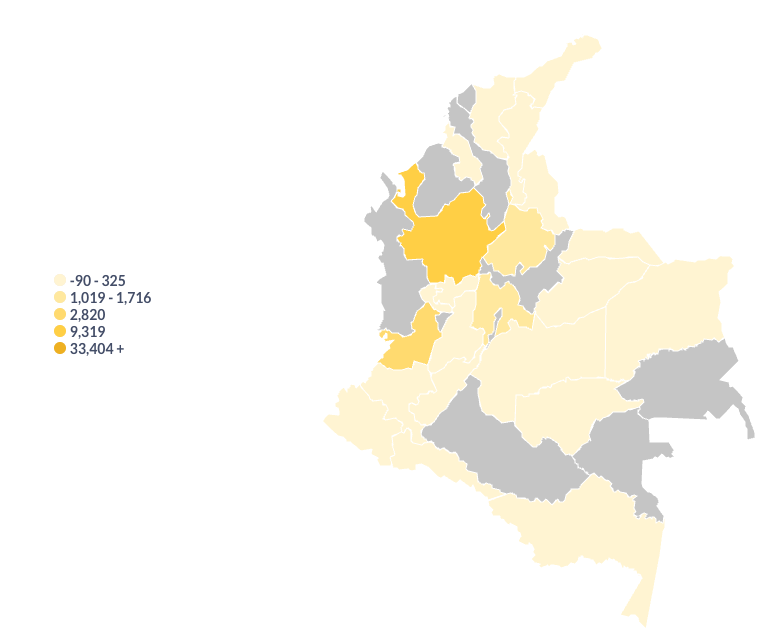
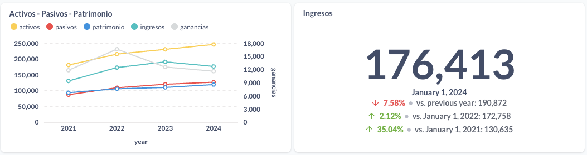
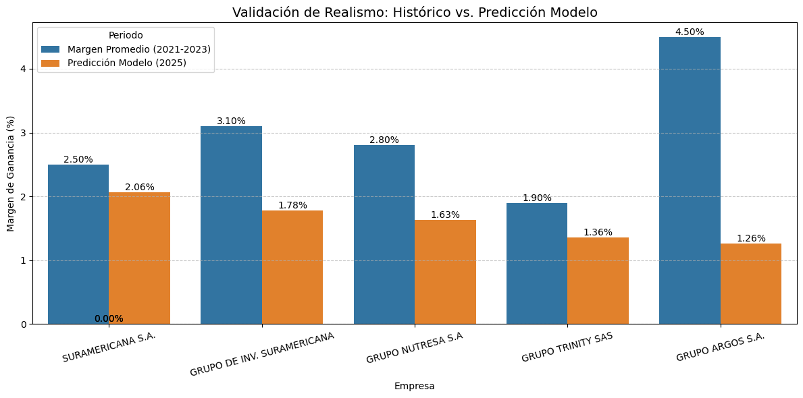

# SECTORA HORIZON
A Future-Focused Analytics System for Industries and Businesses.

<p align="center">


This repository contains the analytical work for challenge:

- Superintendencia de Sociedades

The project follows a modular structure. Shared logic lives in a common core; challenge-specific logic lives in dedicated modules.

<p align="center">
  <a href="http://super.eastus.cloudapp.azure.com:3080/public/dashboard/8b77ad68-c6e5-4919-a387-0638966b4476">
    
  </a>
</p>

<p align="center">
  <a href="https://drive.google.com/file/d/10hoC67ZqF4X9Kc_EgNOL2yG4Oe9Ku9T4/view?usp=sharing">
    
  </a>
</p>

<p align="center">
  <a href="https://your-video-link-here">
    
  </a>
</p>

## Repository Structure
```bash
sectora-horizon/
├── src/                    # Core logic for challenge
├── scripts/                # ETLs, preprocessing, EDA runners, pipelines
├── data/
│   ├── raw/                # Unmodified datasets
│   └── processed/          # Cleaned / engineered datasets
├── sandbox/                # Personal workspaces
│       ├── eda/
│       └── ...
└── .devcontainer/
```
---
## Dashboards

**Sectora Horizon** runs on **Metabase**, powered by **PostgreSQL** as the analytical engine.  
The system provides two main dashboards: **Historical** and **Predictive**.

---

### **1. Historical Dashboard**

- Year-over-year evolution of revenue, assets, liabilities, and equity.  
- Average financial margins by company and sector.  
- Geographic distribution by department.

**Map**

<p align="center">
  
</p>

---

### **2. Predictive Dashboard**

Updated automatically when running the inference module:

- Projected margin by company.  
- Estimated earnings.  
- Sector ranking under different macroeconomic assumptions (PIB, interest rates).  
- Dashboards refresh automatically once PostgreSQL tables are updated.
  
**Company-Level Financial View**

<p align="center">
  
</p>

---
## Predictive Model

Two specialized **LightGBM** models were trained to capture the heterogeneous behavior of Colombian companies:

- **Expert_Servicios**  
- **Expert_Resto**

Both models use **78 numerical and engineered features**, including:

- Revenue and profit lags  
- Year-over-year growth rates  
- 3-year moving averages  
- Macroeconomic variables (GDP, inflation, DTF, TRM)  
- Sectoral dummy variables  
- Interaction terms: *sector × GDP* and *sector × DTF*
---

## Final Metrics (MAE %)

| Model             | MAE     |
|------------------|---------|
| Expert_Servicios | 0.0287  |
| Expert_Resto     | 0.0307  |

Both models exhibit **high stability** and **low variance**, making them suitable for large-scale financial forecasting.

**Historical vs Predicted Validation**

<p align="center">
  
</p>

## Documentation

Technical details/workflow, dataset structure, modeling logic, and Metabase integration — are available in  
📁 **[docs/](docs/)**