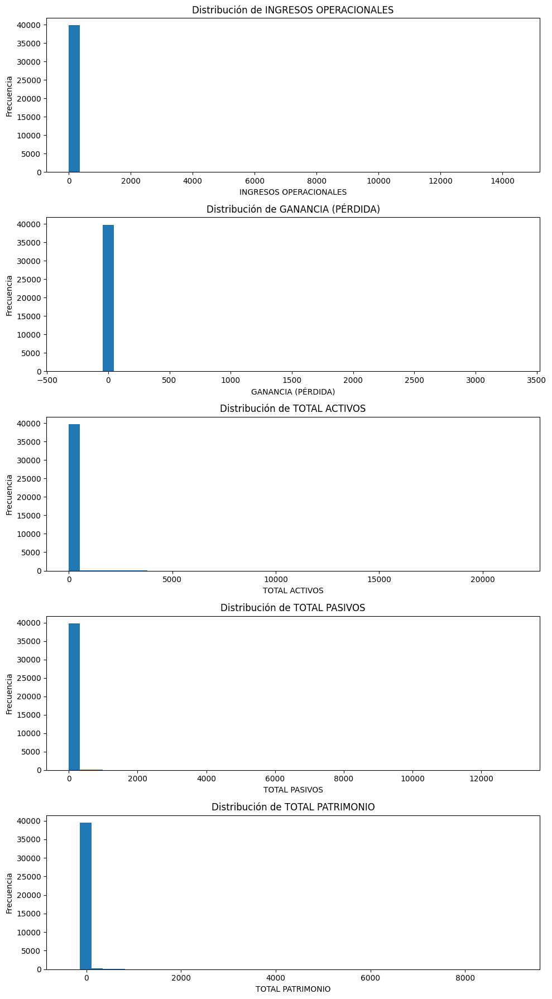
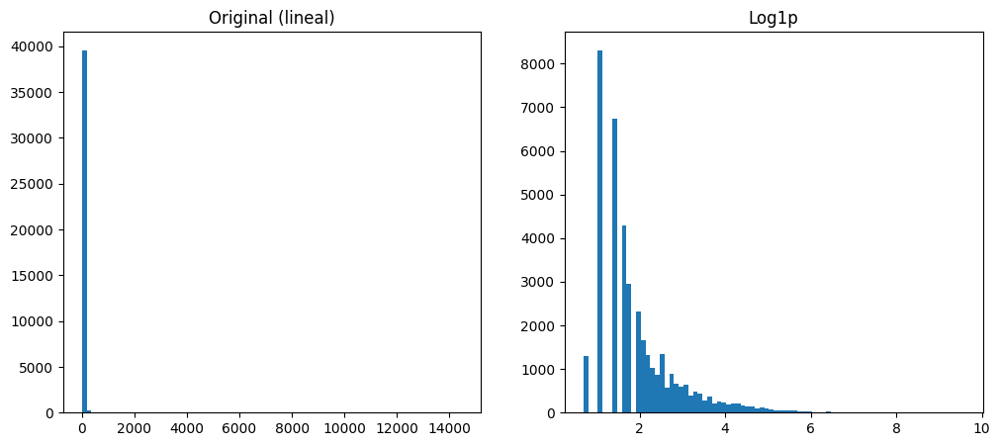
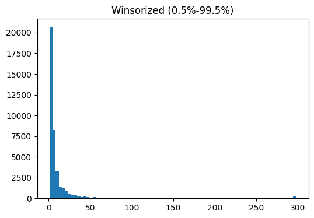
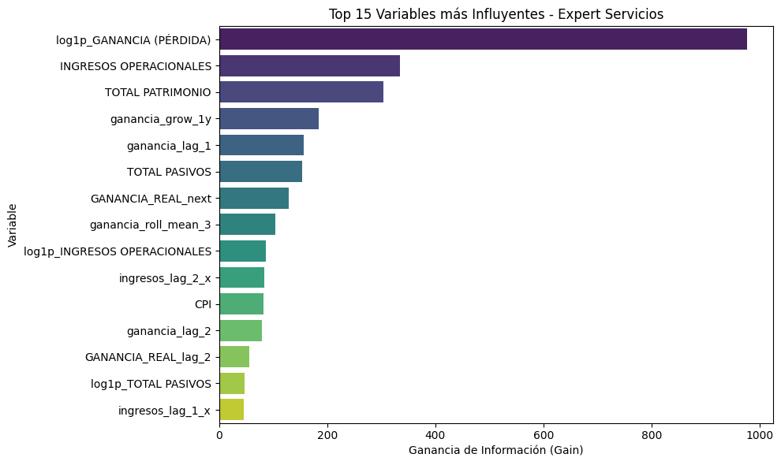
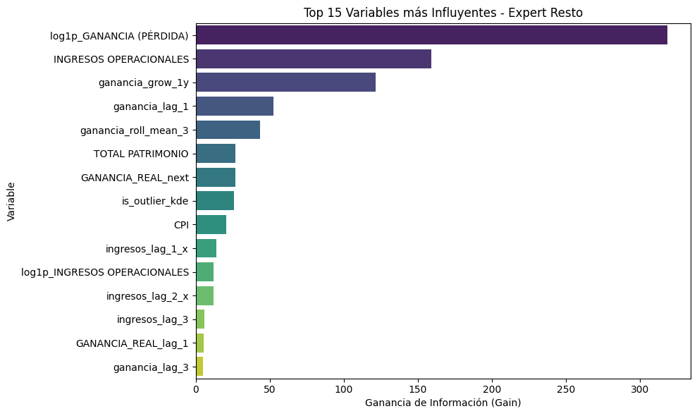
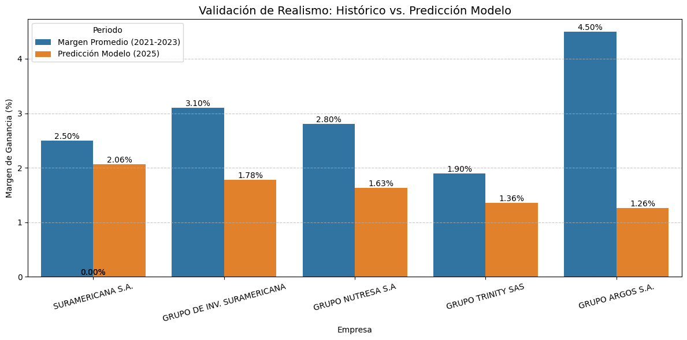

# Documentación Técnica: Modelo Predictivo de Rentabilidad Empresarial

**Fecha:** 29 de noviembre de 2025  
**Contexto:** Predicción financiera basada en históricos reportados a la Superintendencia  
**Versión del Documento:** 1.0  

---

## 1. Resumen Ejecutivo y Objetivo

El objetivo de este proyecto es desarrollar un modelo de *Machine Learning* capaz de estimar la rentabilidad futura ($t+1$) de las empresas colombianas. El modelo busca predecir específicamente el **margen de ganancia**, priorizando la capacidad de generalización sobre empresas no vistas en el conjunto de entrenamiento.

El sistema utiliza un enfoque de **series de tiempo de panel**, incorporando variables financieras históricas, ajustes macroeconómicos (inflación) y características derivadas (lags, medias móviles) para mitigar la alta varianza inherente a los datos financieros corporativos.

---
## 2. Preprocesamiento y Limpieza de Datos

### 2.1 Normalización y Casteo

Dada la naturaleza de los datos crudos, se implementó un pipeline de limpieza estricto:

- **Parsing Numérico:**  
  Eliminación de caracteres no numéricos (signos de moneda, separadores de miles) y conversión forzada a `float64` para variables críticas:
  - INGRESOS OPERACIONALES  
  - GANANCIA (PÉRDIDA)  
  - TOTAL ACTIVOS / PASIVOS / PATRIMONIO  

- **Manejo de Nulos:**  
  Se priorizó el uso de algoritmos tolerantes a `NaN` (LightGBM).  
  Para modelos que no lo soportan (RandomForest), se imputaron valores faltantes mediante:
  - Mediana global, o  
  - Mediana sectorial (cuando existía heterogeneidad marcada entre sectores).

---

### 2.2 Análisis de Distribuciones Iniciales

El análisis exploratorio reveló distribuciones altamente asimétricas (*heavy-tailed*) en todas las variables financieras, lo cual justifica la necesidad de transformaciones no lineales para estabilizar la varianza del modelo.

**Figura 1:** Histogramas de las variables financieras originales.  
Se observa una curtosis extremadamente alta, indicando que la mayoría de las empresas se concentran en rangos bajos, mientras existen outliers de magnitud considerable.

---

### 2.3 Ajuste Macroeconómico

Para garantizar la comparabilidad temporal de los estados financieros a lo largo de varios años fiscales, se realizó un ajuste por inflación utilizando el Índice de Precios al Consumidor (IPC / CPI):

$$
\text{Ganancia Real} = \frac{\text{Ganancia Nominal}_t}{\text{CPI}_t}
$$

Esto permite al modelo aprender patrones estructurales de rentabilidad en lugar de patrones puramente inflacionarios.

---

## 3. Ingeniería de Características (Feature Engineering)

### 3.1 Detección y Tratamiento de Outliers

En lugar de eliminar outliers (lo cual sesgaría el modelo al ignorar grandes conglomerados), se optó por **marcarlos y transformar la escala**:

- **Detección:**  
  Se implementó una estimación de densidad por Kernel (KDE) segmentada por `MACROSECTOR` y `Año`.  
  Registros con densidad probabilística inferior a un umbral fueron marcados como:
  - `is_outlier_kde`

- **Transformación:**  
  Se aplicaron:
  - Transformaciones logarítmicas (`log1p`)  
  - Winsorization (*clipping* entre percentiles 0.5% y 99.5%)

  Esto reduce el impacto de valores extremos en el gradiente durante el entrenamiento.

#### Comparativa de Transformaciones

A continuación se observa cómo la transformación logarítmica y la winsorización normalizan la distribución de los datos, facilitando la convergencia del algoritmo:

- **Figura 2:** Comparativa de distribución original vs. transformación `log1p`

- **Figura 3:** Distribución resultante tras aplicar *Winsorization*

---

### 3.2 Construcción de Variables Predictoras

El dataset final se estructuró a nivel **NIT - Año**, generando las siguientes características:

- **Target ($Y$):**  
  `Margin_next` (Margen de ganancia del año siguiente).  
  Se seleccionó el margen sobre la ganancia absoluta para normalizar por escala de ingresos.

- **Rezagos (Lags):**  
  Variables $t-1$ a $t-4$ de:
  - Ganancia  
  - Ingresos  

- **Tendencia:**  
  - Medias móviles (`roll_mean_3`)  
  - Volatilidad histórica de la ganancia  

- **Estructurales:**  
  - Dummies de `MACROSECTOR`  
  - Categorización por tamaño de ingresos (`size_category`)

---

## 4. Estrategia de Modelado

### 4.1 Selección de Algoritmos

Se implementó un esquema de **ensamblaje o selección condicional**:

- **LightGBM (Modelo Principal):**  
  Elegido por:
  - Manejo nativo de valores faltantes  
  - Velocidad de entrenamiento  
  - Capacidad de capturar no linealidades (GBDT)

  **Hiperparámetros clave:**
  - `num_leaves = 15–31`
  - `learning_rate = 0.02–0.05`
  - `reg_alpha` / `reg_lambda` para regularización L1 / L2

- **RandomForest (Fallback):**  
  Utilizado como mecanismo de respaldo junto con imputación por mediana.

---

### 4.2 Estrategia de Validación (GroupKFold)

Para evitar *data leakage*, se descartó la validación cruzada aleatoria simple.

Se implementó **GroupKFold** utilizando el `NIT` como identificador de grupo.

**Justificación:**  
Esto garantiza que todos los registros históricos de una empresa estén:

- O bien en entrenamiento,  
- O bien en validación,  

pero **nunca mezclados**. Este diseño simula el escenario real de predecir sobre una empresa nueva o futura.

---

### 4.3 Modelos Expertos por Sector

El diagnóstico de errores mostró que ciertos sectores presentan dinámicas de volatilidad muy distintas:

- Ejemplos:
  - **Minería y Energía** vs.  
  - **Servicios y Comercio**

Se entrenaron modelos "expertos" por segmento:

- Modelo **Servicios**
- Modelo **Resto** (Manufactura, Agro, etc.)

---

## 5. Resultados y Evaluación

### 5.1 Importancia de Variables (Feature Importance)

El análisis de **Gain** en los árboles de decisión revela los principales *drivers* de la predicción.

#### Modelo Servicios

Las variables más relevantes son:

1. Historia reciente de ganancias (`log1p_GANANCIA`)  
2. Tamaño y solidez financiera (INGRESOS, PATRIMONIO)

**Figura 4:** Feature Importance para el sector Servicios.

---

#### Modelo Resto

Además de la historia financiera, aparecen con mayor peso:

- TOTAL PATRIMONIO  
- Variables de transformación de outliers (`is_outlier_kde`)

**Figura 5:** Feature Importance para el resto de sectores.

---

### 5.2 Validación de Realismo (Sanity Check)

Se realizó una validación cualitativa comparando las predicciones para 2025 contra el margen promedio histórico (2021–2023) de holdings empresariales conocidos.

**Figura 6:** Comparativa entre:

- Margen promedio histórico  
- Predicción modelo 2025  

El modelo predice márgenes conservadores y coherentes con la historia reciente (ej.: Grupo Nutresa, Suramericana), demostrando que ha aprendido patrones estructurales reales.

---

## 6. Conclusiones Técnicas y Futuros Pasos

El uso de **Margen de Ganancia (%)** como objetivo, combinado con validación **GroupKFold**, ha resultado en un sistema robusto que:

- Reduce el sobreajuste por escala  
- Mejora la capacidad de generalización  

### Recomendaciones para Despliegue

- **Producción:**  
  Usar el modelo de Margen (%) como estándar operativo.

- **Intervalos de Confianza:**  
  Implementar:
  - *Quantile Regression*, o  
  - *Bootstrapping*  

  para estimar incertidumbre, especialmente en empresas altamente volátiles.

- **Variables Exógenas:**  
  Integrar proyecciones macroeconómicas:
  - TRM  
  - DTF proyectada  

  como *features* para ajustar la predicción ante shocks externos en 2025.

---